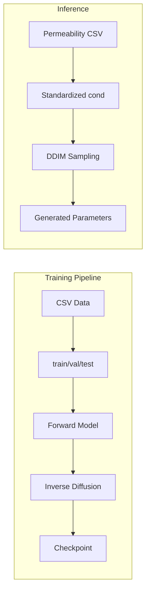

# Inverse Permeability PG

Conditional diffusion models for generating physical material parameters from permeability values (Kxx, Kyy, Kzz).

## Project Overview

- **Goal**: Learn an inverse mapping from permeability (Kxx, Kyy, Kzz) to physical material parameters using a conditional diffusion model.
- **Problem**: Multiple parameter sets can map to the same permeability; diffusion models capture this one-to-many relationship and generate diverse plausible samples.
- **Reference**: "Step-by-Step Diffusion: An Elementary Tutorial" (Nakkiran et al., Apple/Mila)

## Architecture



Note: `Main/inverse_last_version.py` (the main script) uses inverse diffusion only and skips the forward model step.

## File Descriptions

| File | Purpose | Key Features |
|------|---------|--------------|
| [Main/inverse_last_version.py](Main/inverse_last_version.py) | **Main and most important** - inverse diffusion only | Primary entry point; no forward model, lighter, full CLI, CSV batch generation |
| [Main/Inverse.py](Main/Inverse.py) | Full pipeline with forward model | Forward + inverse diffusion, CLI, CSV batch generation, checkpoint resume |
| [diffusion_model_ash.py](diffusion_model_ash.py) | Standalone diffusion script | Forward + inverse, hardcoded config, `lambda_forward` for consistency loss |
| [backward.py](backward.py) | Diffusion with structure plotting | Structure comparison plots, `generate_structure_from_params` placeholder |
| [latest_inverse.py](latest_inverse.py) | Diffusion with analysis plots | Predicted vs actual R² plots, individual sample bar charts |

## Input Format

**Training CSV** (e.g. `result_no_duplicates_behnaz.csv`):

- **Required columns**: `Kxx`, `Kyy`, `Kzz` (permeability values)
- **Excluded from parameters**: `id`, `seed`, `Kxx`, `Kyy`, `Kzz`
- **Parameter columns**: All other columns (e.g. porosity, pore size, structure type)
- **Preprocessing**: Permeability clipped to ≥1e-30, scaled by (2e-6)², then log₁₀, then StandardScaler

**Inference CSV** (for `--input-csv`):

- Same structure: must have `Kxx`, `Kyy`, `Kzz`
- Rows with NaN in permeability are dropped

## Output Format

| Output | Location | Description |
|--------|----------|-------------|
| Forward model checkpoint | `runs/perm_inverse_diffusion/forward_model/` | Best ForwardMLP (params → permeability). Not produced by `inverse_last_version.py` |
| Inverse diffusion checkpoint | `runs/perm_inverse_diffusion/` | `invdiff-*.ckpt` files |
| Scalers | `scaler_x0.joblib`, `scaler_cond.joblib` | For inverse-transforming predictions |
| Predictions | `predictions.csv` or `predicted_from_file.csv` | Generated parameters; column order: metadata, params, Kxx/Kyy/Kzz |

## Usage (Main/inverse_last_version.py - Main Entry Point)

```bash
# Train from scratch
python Main/inverse_last_version.py

# Inference only (requires trained checkpoint)
python Main/inverse_last_version.py --checkpoint path/to/invdiff.ckpt --inference-only

# Generate samples from CSV (multiple samples per row)
python Main/inverse_last_version.py --checkpoint path/to/invdiff.ckpt --inference-only \
  --input-csv your_permeabilities.csv --samples-per-row 1000 --num-steps 500

# Resume training
python Main/inverse_last_version.py --checkpoint path/to/invdiff.ckpt --resume

# Fixed seed for reproducibility
python Main/inverse_last_version.py --checkpoint path/to/invdiff.ckpt --inference-only \
  --input-csv your.csv --fixed-seed
```

### CLI Arguments

| Argument | Description |
|----------|-------------|
| `--checkpoint` | Path to checkpoint file (required for inference/resume) |
| `--resume` | Resume training from checkpoint |
| `--inference-only` | Skip training, only run inference |
| `--input-csv` | Path to CSV with Kxx, Kyy, Kzz for batch generation |
| `--samples-per-row` | Number of samples per input row (default: 1000) |
| `--num-steps` | Diffusion steps for sampling (default: 500) |
| `--fixed-seed` | Use fixed seed for deterministic outputs |

## Model Components

- **ForwardMLP**: parameters → standardized log₁₀(Kxx, Kyy, Kzz) *(not used in inverse_last_version.py)*
- **DiffusionMLP**: denoiser predicting x₀ from (xₜ, cond, t)
- **Forward diffusion**: xₜ = x₀ + σ(t)·ε
- **Noise schedule**: Cosine, σ_min=0.01, σ_max=1.0
- **Sampling**: DDIM, 500 steps (configurable)

## Dependencies

- torch
- pytorch-lightning (or lightning)
- numpy
- pandas
- scikit-learn
- joblib

Install with:

```bash
pip install -r requirements.txt
```

Or manually:

```bash
pip install torch pytorch-lightning numpy pandas scikit-learn joblib
```

## Configuration

Key config values (editable in code):

| Parameter | Default | Description |
|-----------|---------|-------------|
| `csv_path` | `./result_no_duplicates_behnaz_remove_10.csv` | Training data path |
| `val_size` | 0.15 | Validation fraction |
| `test_size` | 0.15 | Test fraction |
| `batch_size` | 64 | Training batch size |
| `max_epochs` | 500 | Maximum training epochs |
| `learning_rate` | 3e-4 | Learning rate |
| `num_steps` | 500 | Diffusion steps for sampling |

## Which File to Use

- **Main entry point (recommended)**: [Main/inverse_last_version.py](Main/inverse_last_version.py) — the main and most important script; inverse diffusion only, no forward model, lighter, full CLI and CSV batch support
- **Full pipeline with forward model**: [Main/Inverse.py](Main/Inverse.py) — includes forward model training and optional forward-consistency loss
- **Quick experiments**: [diffusion_model_ash.py](diffusion_model_ash.py) — edit `csv_path` and run
